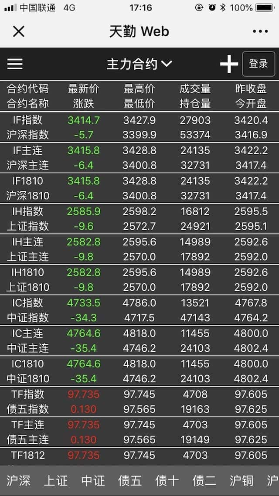
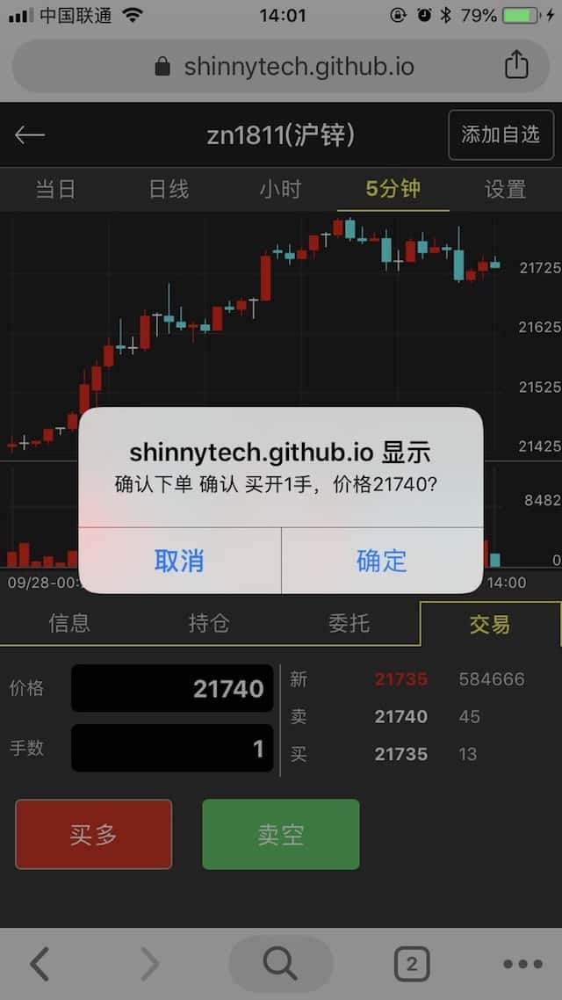
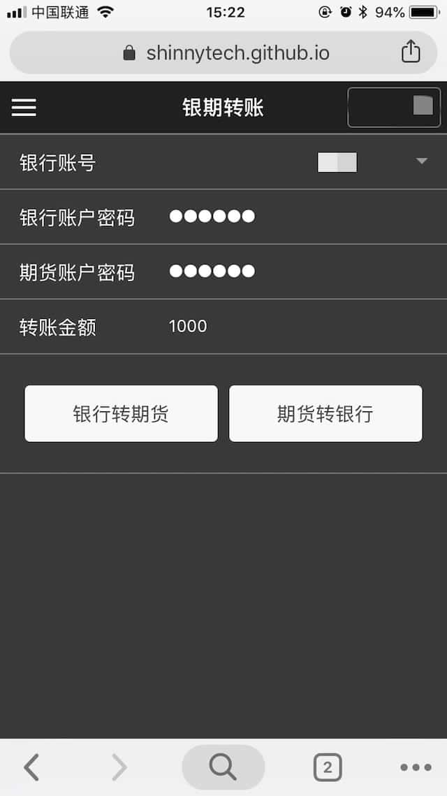
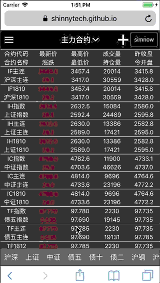
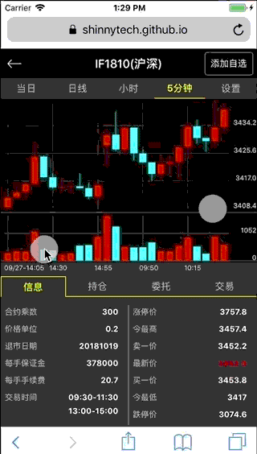
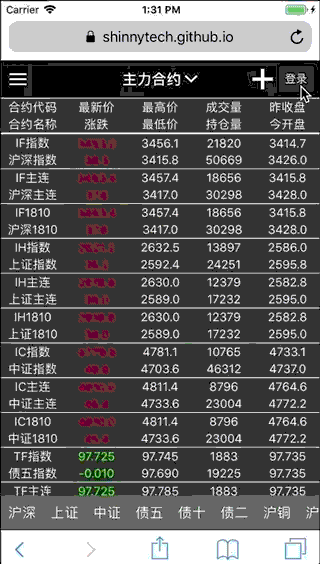

# shinny-futures-h5

一个开源的 HTML5 期货行情交易终端。 

## 项目预览
-----------------------
在线演示地址 [https://shinnytech.github.io/shinny-futures-h5/index.html](https://shinnytech.github.io/shinny-futures-h5/webpage.html) ，使用手机扫一扫，用手机浏览器打开效果更好。

<br>

   <br>

  <br>


## 功能说明
-----------------------

* [x] 期货合约行情报价。
* [x] K线图，Tick图，盘口报价。
* [x] 登录期货交易账户。
* [x] 查看账户资金。
* [x] 下单、撤单。
* [x] 查看账户持仓记录，委托单记录。
* [x] 按照手数平仓。
* [x] 银期转账及转账记录。
* [x] 可配置界面。


## 如何使用
-----------------------

### 1. 将项目克隆到本地

    git clone https://github.com/shinnytech/shinny-futures-h5

### 2. 在项目目录下运行任意 http server

可以选择任意一种熟悉的开发环境来运行。

* NodeJs 环境下
    1. 安装 nodejs。
    
    2. 安装 http-server `npm install -g http-server`。
    
    3. 项目目录下运行 `http-server -a 0.0.0.0 -p 8888`。
    
    4. 浏览器打开 `http://127.0.0.1:8888/`。

* Python 环境下
    1. 安装 python。
    
    2. 查看 python 版本 `python -V` 。
    
    3. 项目目录下运行：
        
        `python -m http.server` (python版本 3.X)
        
        `python -m SimpleHTTPServer` (python版本 2.X)
  
    4. 浏览器打开 `http://127.0.0.1:8000/`。
    
* Chrome 浏览器插件
    1. 安装 Chrome 浏览器。
    
    2. 在 Chrome 浏览器安装 [web-server-for-chrome](https://chrome.google.com/webstore/detail/web-server-for-chrome/ofhbbkphhbklhfoeikjpcbhemlocgigb) 插件。
    
    3. 在 **web-server-for-chrome** 插件中选择项目文件夹，输入端口号，即可在浏览器访问。

### 3. 项目配置

修改 `zqjs/configuration.js` 文件可以对项目进行配置。


#### 3.1 服务器连接相关参数
```js
var SETTING = {
    sim_server_url: 'wss://openmd.shinnytech.com/t/md/front/mobile', // 行情接口
    tr_server_url: 'wss://opentd.shinnytech.com/trade/user0', // 交易接口
    default_bid: 'S上期技术', // 默认期货公司
    reconnect_interval: 2000, // 重连时间间隔 ms
    reconnect_max_times: 5, // 最大尝试重连次数
};
```

#### 3.2 界面显示相关参数
```
// CONST 对象用来保存界面显示相关参数，不要删除这个对象
var CONST = { ... }
```

#### 3.3 期货合约行情报价界面

行情报价列表每个合约分两行显示， 通过以下设置可以配置需要显示的字段，例如：

```js
var CONST = {
     // ......
    // 第一行显示的字段
    inslist_cols_odd: ['last_price', 'highest', 'volume', 'pre_close'],
    // 第二行显示的字段
    inslist_cols_even: ['change', 'lowest', 'open_interest', 'open'],
    // 所有可选的字段，及对应列首显示名称
    inslist_cols_name: {
       "volume_multiple": "合约乘数",
       "price_tick": "价格单位",
       "ask_price1": "卖价",
       "ask_volume1": "卖量",
       "bid_price1": "买价",
       "bid_volume1": "买量",
       "last_price": "最新价",
       "highest": "最高价",
       "lowest": "最低价",
       "amount": "成交额",
       "volume": "成交量",
       "open_interest": "持仓量",
       "pre_open_interest": "昨持仓",
       "pre_close": "昨收",
       "open": "今开",
       "close": "收盘",
       "lower_limit": "跌停",
       "upper_limit": "涨停",
       "average": "均价",
       "pre_settlement": "昨结",
       "settlement": "结算价",
       "change": "涨跌",
       "change_percent": "涨跌幅"
   },
    // ......
 }
```

#### 3.4 K 线图颜色
```js
var CONST = {
     // ......
    chart_color: {
        'background': "#111", // K线图背景色
        'down': '#00FFFF', // 下跌柱子颜色
        'up': 'red', // 上涨柱子颜色
    },
    // ......
 }
```


## Changelog
-----------------------

### 2018-09-27

#### Added
* 支持鼠标操作 K 线图，拖动、缩放

#### Fixed
* 确认登录逻辑

### 2018-08-31

#### Added
* 按品种快速定位合约列表
* 可以按照手数平仓
* 添加可配置选项

#### Fixed
* 部分手机列表页滑动不流畅，显示重叠
* 键盘首次打开删除键无效
* 市价委托单价格显示0
* Ios 锁屏退出后，重连服务器，没有登录
